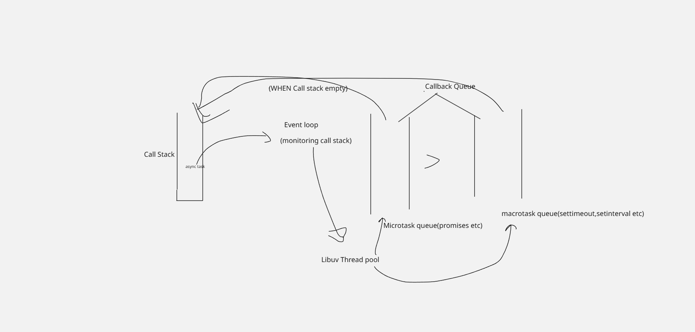

1.  What is NodeJS - A runtime that is used for executing JS code outside the browser . It is built on Google Chrome's V8 JS engine.
    Features -
    Single Threaded
    Non- Blocking Asynchronous I/O

2.  I/O tasks - DBquery , file reading (basically already defined in NodeJS that these types of tasks u have to run in thread pool main identification having callbacks ,promises,async/await).
    CPU tasks - Synchronous tasks that runs on main call stack only.

3.  If NodeJS single threaded then how it handle concurrency ?
    Basically it achieves concurrency using event loop + callbacks + libuv(thread pool of OS)

    So we have call stack where all tasks executed
    So if we have sync task it execute there until then all other stop
    if we encounter async then our event loop continuously monitoring task queue it sends that task to the libuv(thread pool) and other sync task execution starts
    so if we again encounter async then same process as above so after libuv complete the process it then send the task callback to the micro(promises , async await) or macro callback(settimeout,setinterval) queue depends on what tasks it is(they also have priority micro>macro)

    so at last when all sync tasks completed means call stack become empty then again event loop take tasks from micro first then macro and assigned their callbacks for the execution to the call stack again

    

4.  Module vs Package
    Module = Single file or built-in functionality (e.g., fs, path, your own .js file).

    Package = Collection of modules, comes with package.json, usually installed via npm (e.g., express, lodash).

5.  What is middleware?
    Middleware is the function that works between the request and the response cycle. Middleware gets executed after the server receives the request and before the controller sends the response.

6.  REPL(Read , Evaluate, Print ,Loop)
    It’s basically a command-line tool that comes with Node.js for quickly running and testing JavaScript/Node code interactively.

7.  There are the two most commonly used libraries in NodeJs:

    ExpressJS: ExpressJS is a minimal and flexible web application framework for building robust APIs and web apps. It simplifies routing, middleware handling, and request/response management.
    Mongoose: An Object Data Modeling (ODM) library for MongoDB and NodeJS, it helps in managing data relationships, schema validation, and business logic.

8.  Buffer -A buffer is a temporary memory storage area used to handle binary data (like files, videos, images, TCP streams).

9.  What are streams in Node.js?

        Streams let you process data piece by piece instead of loading the entire data into memory.

        They’re great for big files or network data.

        Types of Streams:

        Readable – for reading data (e.g., fs.createReadStream)

        Writable – for writing data (e.g., fs.createWriteStream)

        Duplex – both readable & writable (e.g., net.Socket)

        Transform – modify data while streaming (e.g., zlib.createGzip)

10.     console.log("start");

        process.nextTick(() => console.log("nextTick"));
        setImmediate(() => console.log("setImmediate"));

        console.log("end");
        // Output: start → end → nextTick → setImmediate

11. CORS -
    Browser blocks Cross Origin Resource Sharing so Node.js just needs to respond with proper headers so that the browser and NOdeJS can communicate

12. What is piping in NodeJS?
    In NodeJS, piping refers to the process of passing the output of one stream directly into another stream. It allows data to flow through multiple streams without needing to store it in memory or temporarily write it to disk. This is a common pattern used in file handling, HTTP requests, and other I/O operations in NodeJS.

13. Web Socket
    Web Socket is a modern web technology in which there is a continuous connection between the user’s browser (client) and the server. In this type of communication, between the web server and the web browser, both of them can send messages to each other at any point in time.
    In normal , browser req something in return NodeJS server responds.

14. Event Emitter
    It lets different parts of your application communicate asynchronously using events.
    const EventEmitter = require('events');

    // Create an emitter instance
    const emitter = new EventEmitter();

    // Subscribe (listener)
    emitter.on('greet', (name) => {
    console.log(`Hello, ${name}!`);
    });

    // Emit the event
    emitter.emit('greet', 'Vipul');
